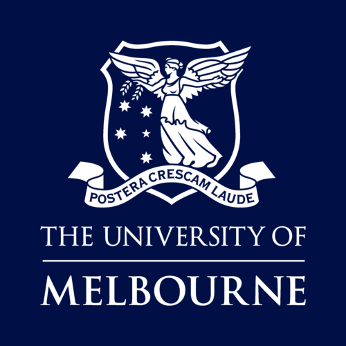

## Phoebe Solutions
- *Data Scientist* | Jul 2023 - Sep 2023
- 
- Tags: Work
- Badges:
  - Internship [teal]
- List Items:
  - Worked with the development and implementation of AI assistants, Health Informatics and its applications in optimising private hospital billing. 
  - Utilised the best practices in software development and deployment, utilise cloud computing and networking and working with Node.js, MongoDB, and Machine Learning.

## Mathstar
- *Tutor* | Mar 2023 - Present
- 
- Tags: Work
- Badges:
  - VCE Tutor [teal]
- List Items:
  - Provided personalised tutoring in both 1-on-1 and group sessions with completely tailored teaching methods to each individual student, in subjects including but not limited to Specialist Mathematics, Mathematical Methods, and Further Mathematics
  - Possess excellent problem-solving and on-the-spot critical thinking, as well as analytical skills that are needed to break down complex mathematical problems into manageable components and then formulate a solution that can effectively communicate ideas to students
  - Collaborated with other tutors in the company to strengthen individual points in different subjects for certain students, together we organised and divided tasks to form a functional team focused around helping students

## Private Tutor
- *Tutor* | Feb 2024 - Present
 
- Tags: Work
- Badges:
  - Independent [teal]
- List Items:
  - Developed and implemented work plans tailored to individual student needs and adapting and changing the work plan based on the degree of difficulty for the student, specifically wocusing on building strength in areas of weakness and preparation for exam conditions
  - Demonstrated effective one-on-one communication skills as well as the ability to succinctly and efficiently illustrate ideas in a way that students could understand
  - Tutored a range of subjects including but not limited to, Specialist Mathematics, Mathematical Methods, Introductory Python and Introductory Algorithms

## The University of Melbourne
- *Bachelor of Science, Major in Data Science* | Expected Nov 2024
- 
- Tags: Study
- Badges:
  - Bachelor [teal]
- List Items:
  - Second Class Honours A
  - Machine Learning, Linear Statistical Models, Probability, Design of Algorithms, Object Orientated Software Developement

## The University of British Columbia
- *Exchange program, Major in Applied Mathematics* | Sep 2023 - Dec 2023
- 
- Tags: Study
- Badges:
  - Exchange [teal]
- List Items:
  - Average: 81.8%
  - Statistical Inference, Linear Programming, Applied Linear Algebra